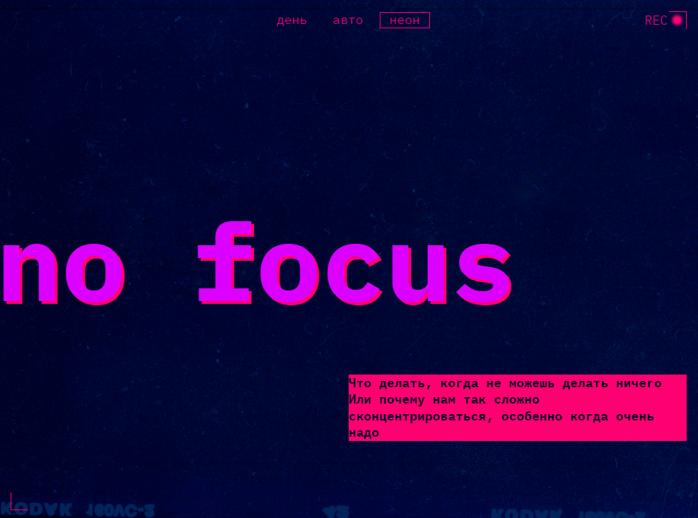
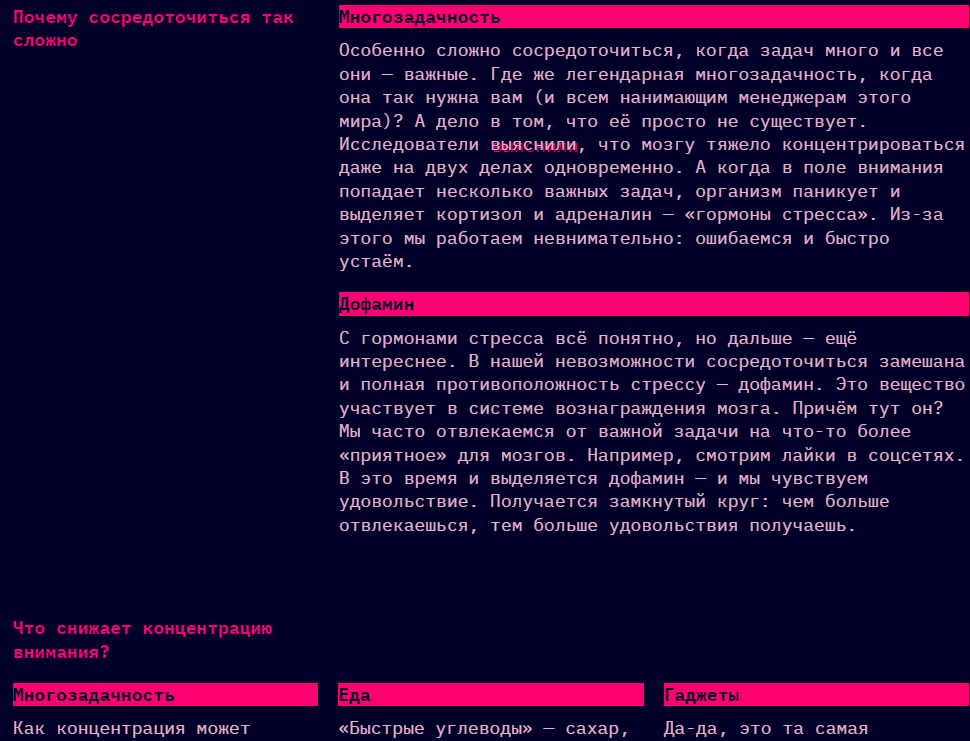

# Сложно сосредоточиться — адаптивный сайт с темами

Адаптивный лендинг со светлой и тёмной темами оформления. Свёрстан на HTML и CSS, тема переключается через JavaScript. Проект выполнен по готовому макету в рамках курса.

## Макет

[Ссылка](https://www.figma.com/design/lCqDbWjgllgJtb2hmCqfyX/-6-Сложно-сосредоточиться?node-id=0-1)

## Скриншоты




## Технологии

- HTML5: семантическая разметка, метатег `color-scheme`
- CSS3: Grid, Flexbox, логические свойства, CSS-переменные, `clamp()`, медиазапросы, псевдоэлементы
- Vanilla JS: переключение тем
- БЭМ

## Запуск

Открыть `index.html` в браузере или запустить локальный сервер:

```bash
python3 -m http.server 8080
# Открыть http://localhost:8080
```

## Структура

```
posmotri-v-okno/
├── index.html
├── fonts/
├── images/
├── styles/
│   ├── variables.css     # CSS-переменные (цвета, шрифты, отступы)
│   ├── globals.css       # сброс браузерных стилей
│   ├── style.css         # основные стили + медиазапросы
│   ├── dark.css          # тёмная тема
│   └── light.css         # светлая тема
└── scripts/
    └── script.js         # переключение тем
```

## Темы

Основная тема — тёмная. Переключение работает двумя способами:

- **Автоматически** — по настройке ОС через `prefers-color-scheme`
- **Принудительно** — кнопками «День», «Неон», «Авто», которые добавляют класс на `<html>`:
  - `.theme-light` — светлая
  - `.theme-dark` — тёмная
  - `.theme-auto` — по системе

Все цвета хранятся в CSS-переменных и переопределяются в `dark.css` / `light.css`.

## Особенности

- Ррезиновая вёрстка между брейкпоинтами
- Логические свойства (`margin-block-start`, `border-inline-end`)
- Псевдоэлементы для декоративных точек и уголков
- `aria-hidden="true"` для декоративных элементов
- `outline` вместо `border` для фокуса, стили `:focus-visible`, `:hover`
